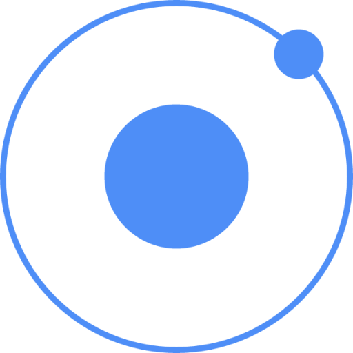

<h1 align="center"><b>Hi , I'm Victor Garcia </b></h1>

 

 

🏠 I’m currently living at Armenia, Colombia 🇨🇴. 
👨‍💻 I’m currently working on Flutter and Android. 
🔭 Currently working as a software engineer at [celuweb]. 
⚡ Available for freelance projects. 

### Connect with me:

[][gmail]
[][linkedin]
[][instagram]

 
 

### Languages and Tools:

 

[celuweb]: https://www.celuweb.com
[linkedin]: https://www.linkedin.com/in/victor-manuel-garcia-hurtado-0700a21b7/
[gmail]: mailto:vmgarciahurtado@gmail.com
[instagram]: https://www.instagram.com/vm_garciah/
